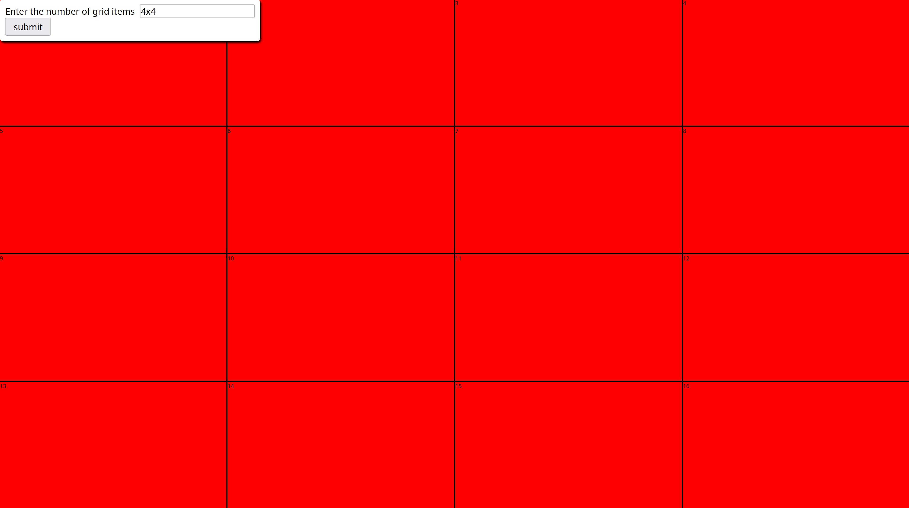
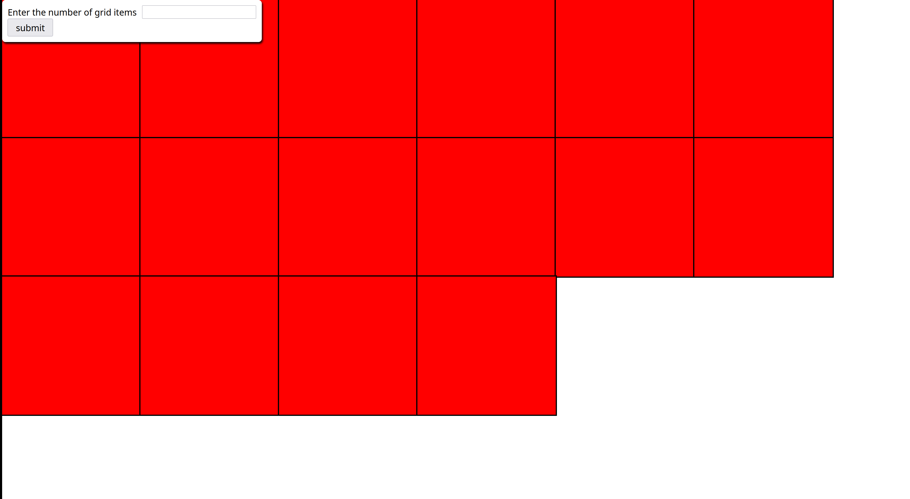

# Project Instructions

This project's instructions is led by [the-odin-project](https://www.theodinproject.com/lessons/foundations-etch-a-sketch)

## Your project must meet the following

1. You must `git clone` this repo. Use this repo as a starting point.

2. You `CANNOT` modify in any shape or form the already pre-made `index.html` file.

3. `css grid` is NOT ALLOWED.

4. Although you might be tempted to use `nested loops`, you `CANNOT` use any nested loops. Problems can be seen very challenging at first.
   Break it down and you will see a nested loop is not needed, specially when we have other tools in our toolset like `flexbox` and
   `flex-basis` ;)... or other ways?

5. The maximum allowed grid size is `40x40`. If the user enters a width or height greater than `40`, the user should be informed. See `output/` for the desired behaviour. If you do not have enough screen space, then `30x30` should be the maximum for you.

6. The design must be close/same to `output/design-full-screen.png`

7. Before the user has a chance to input the grid size, there should be `16` squares layout in the screen.

8. The grid must occupy the full `viewport` height and width of the user's browser, even in `mobile` screens.

9. Users must be able to input the grid size as follows: `4x4`, `33x39`, `5x7`, `40x40`, etc.

10. At most you only need `TWO` loops (again `NOT NESTED LOOPS ALLOWED`). One loop to create the default layout, and the second to create the grid size entered by the user.

## Tips if you get stuck

1. Check [css-pointer-events](https://developer.mozilla.org/en-US/docs/Web/CSS/pointer-events)

2. Check [input-validation](https://developer.mozilla.org/en-US/docs/Web/API/HTMLInputElement/setCustomValidity)

3. Research about `clientWidth` & `clientHeight` properties.

4. Think about `flex-basis` and `flexbox`... how can I use what I learned from previous projects to create a `grid-like` layout. There are different ways to solve this problem, using `flexbox` is just one way!

## Git Branching

If you need a refresher on `Git Branching`. Check [this](https://www.theodinproject.com/lessons/foundations-revisiting-rock-paper-scissors) out.

> [!IMPORTANT]
> This project requires you to setup `Git` and `GitHub`. Use what we have learned so far `Branching`, `Merging`, `Pulling`, and `Pushing`. Also, use `git merge <branch> --no-ff` to preserve branch history. When showcasing your project, you can also show your development branches.
