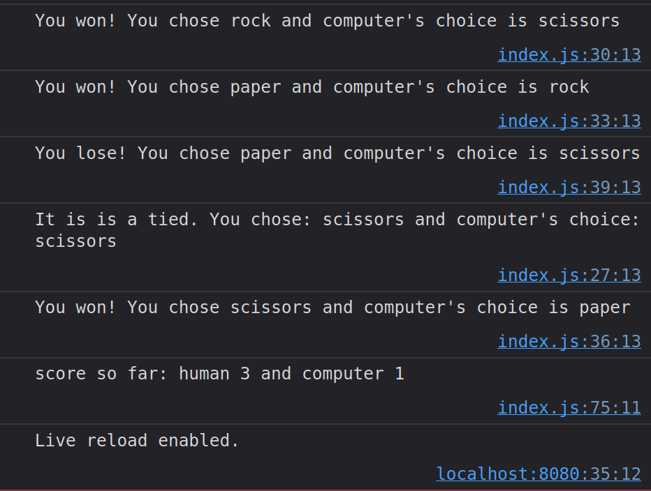
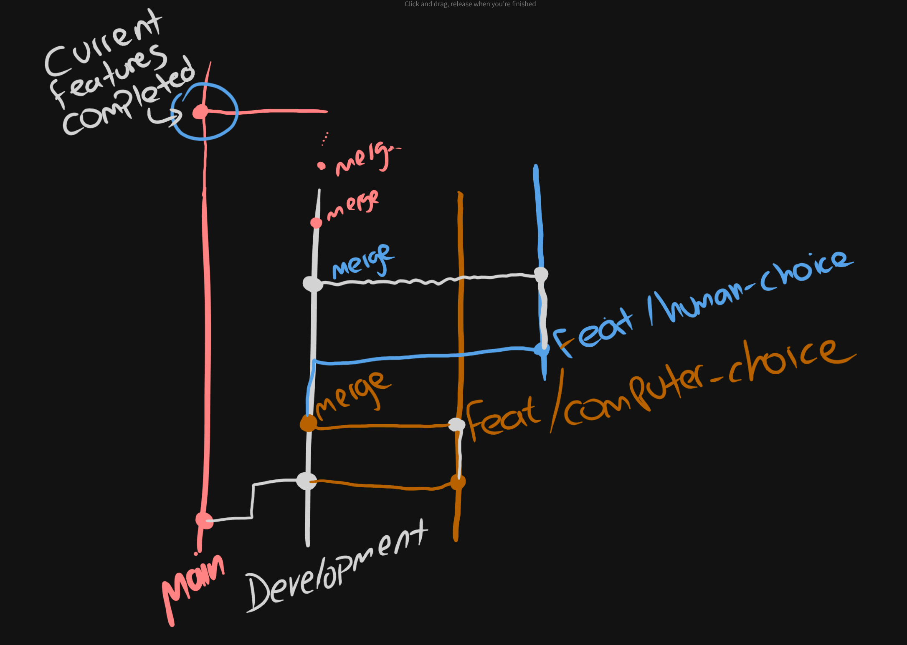

# Project Instructions

This project's instructions is led by [the-odin-project](https://www.theodinproject.com/lessons/foundations-rock-paper-scissors)

## Output

Check folder `output/` for a video & screenshots on how the game is expected to be played and the output it should have.



## Instructions

- You are not allowed to use explicit loops.

- You can only use what we have covered in class: Functions, Arrays, Strings, Strings methods and Numbers.


## `Git` workflow

> [!IMPORTANT]
> Students must use `git` and `github`. The things we have reviewed so far.

The following is the expected output of your `Git` workflow after `git log --graph --all --decorate`. This represents the workflow of developing `Rock Paper Scissors` project.



```text
main -> development
        |
        |_feat/getComputerChoice
        |_feat/getHumanChoice
...
```

```text
*   commit 8db7e3669cb68f120ddb3e503897811189093679 (HEAD -> main, origin/main)
|\  Merge: 48874f1 28485be
| | Author: sample
| | Date:   2 minutes ago
| |
| |     Merge branch 'development'
| |
| *   commit 28485be482d83c31533cc5848b30eace38e683f1 (development)
| |\  Merge: dd50641 d0dbc68
| | | Author: sample
| | | Date:   2 minutes ago
| | |
| | |     Merge branch 'feat/play-game' into development
| | |
| | * commit d0dbc68b3d39ef96c50ada38fe03e3b5ee8b7beb (feat/play-game)
| |/  Author: sample
| |   Date:   2 minutes ago
| |
| |       feat: add play game
| |
| *   commit dd50641482d92aff0fd60920e6e95a938849af04
| |\  Merge: 709d150 5a7ec63
| | | Author: sample
| | | Date:   19 minutes ago
| | |
| | |     Merge branch 'feat/play-round' into development
| | |
| | * commit 5a7ec63f121396e4926c42ffb724d37709ec18e8 (feat/play-round)
| |/  Author: sample
| |   Date:   20 minutes ago
| |
| |       feat: add play around
| |
| *   commit 709d1507dff5b138f20c3e1d0a461d1b7539ee7f
| |\  Merge: b690010 7f2ff09
| | | Author: sample
| | | Date:   39 minutes ago
| | |
| | |     Merge branch 'feat/human-choice' into development
| | |
| | * commit 7f2ff09cbe79b2debfd66e4af03d38a10d1e9fbe (feat/human-choice)
| |/  Author: sample
| |   Date:   39 minutes ago
| |
| |       feat: add human choice
| |
| *   commit b69001087cec9944ef5365ac045beaa7755cd613
| |\  Merge: dc1252a 66df19b
| | | Author: sample
| | | Date:   45 minutes ago
| | |
| | |     Merge branch 'feat/computer-choice' into development
| | |
| | * commit 66df19b0989029777225396603b70a55586a8dfa (feat/computer-choice)
| |/  Author: sample
| |   Date:   48 minutes ago
| |
| |       feat: add getComputerChoice
| |
| * commit dc1252abb1db4f12d423fbdc529def3d019c02ce
|/  Author: sample
|   Date:   68 minutes ago
|
|       chore: fix readme alert
|
* commit 48874f188c823d9abec183900376ec676ee6e730
  Author: sample
  Date:   79 minutes ago

      initial commit
```

> [!IMPORTANT]
> When merging, do `git merge <branch> --no-ff` to preserve branch history.
